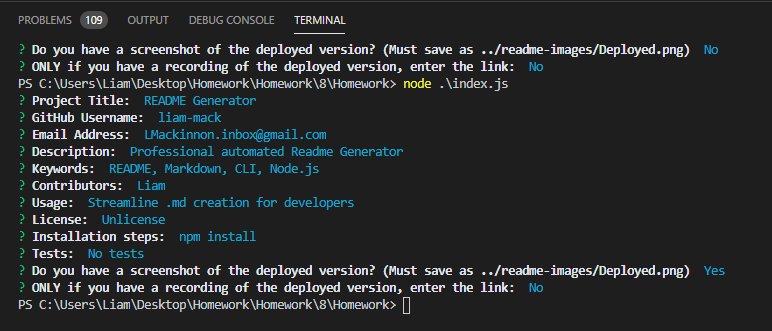

# README Generator

## Table of Contents
> - [Description](#Description)
> - [Keywords](#Keywords)
> - [Contributors](#Contributors)
> - [Usage](#Usage)
> - [Installation](#Installation)
> - [Test](#Testing)
> - [License](#License)
> - [Deployment](#Deployment)
> - [Questions](#Questions)

## Description
>Professional automated README generator

## Keywords
>*README, Markdown, Node.js, CLI*

## Contributors
>Liam Mackinnon

## Usage 
>Streamline .md creation for developers

## Installation
>*npm install*

## Testing
>No tests

## License
>Unlicense

## Deployment
Live Recording?: Yes
https://drive.google.com/file/d/1T_LttS5Zc4y7Gza-tQgr_F49fy-jiRBY/view  

Screenshot?: Yes

### Questions
>If you have any further questions about the application:
>Email: LMackinnon.inbox@gmail.com
>
>GitHub: www.github.com/liam-mack
